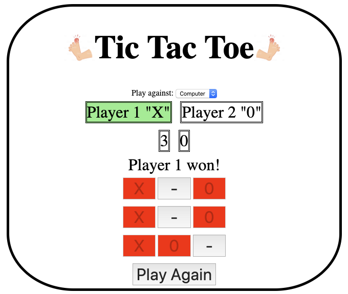

## Table of contents
* [General info](#general-info)
* [Game link](#gamelink)
* [Screenshots](#screenshots)
* [In-depth Features of the game](#in-depth-features-of-the-game)
* [Technologies Used](#technologies-used)
* [Rules of the game](#rules-of-the-game)
* [Approach Taken](#approach-taken)
* [Download](#download)

## General info
This project is to demonstrate that the following requirements are met in developing the TIC TAC TOE game.

* Render a game in the browser
* Switch turns between more than one player
* Design logic for winning & visually display which player won
* Include separate HTML / CSS / JavaScript files
* Stick with KISS (Keep It Simple Stupid) principles
* Use Javascript for DOM manipulation
* Deploy your game online, where the rest of the world can access it
* Use semantic markup for HTML and CSS (adhere to best practices)

## Game Link
* The game can be linked here
[https://mistergjones.github.io/tictactoe/]

## Screenshots

## In-depth code features of the game
* Used 1 master grid array for when a player inserts their 'X' or '0'
* Then split this array either via slice or array indexes into 8 strings
* Where the user clicks on the box, the button GREYS out so it cannot be clicked again.
* If one of the strings is equal to 'XXX' or '000', it displays the winner.
* If there is a winner, it disables all other buttons and shows the "Play again" button to reset
* If there is no winner, it will display a message stating "a draw". It then shows the "Play Again" button to reset.
* Used event handlers and make use of HTML CSS DOM manipulation.
* A button is used to reset the game if WINNER or a DRAW. This "resets" the UI components and .event listeners

## Rules of the game
* Each player takes turns to devise a row of 3 X's or 3 0's.

## Approach Taken
* Via pen and paper, wireframed a basic outline of key elements to be used and how positioned.
* Understood the rules of the game to determine how a winner is determined. i.e. It checks 8 combinations for a winner.
* Re-used the pin-pad functionality from the BANK ATM exercise as part of the solution.
* Spent a lot of time in determining how best to reset the game without doing a "reload". There doesn't seem to be an easy way.

## Technologies
Project is created with:
* Javascript
* CSS
* HTML
* DOM manipulation
	
## Download
Download via:

* https://github.com/mistergjones/tictactoe.git
